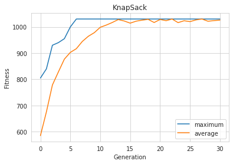

## 🎒 KnapSack Problem
#### Task:
Given a set of items, each associated with certain weight and a value, and a Knapsack of certain capacity, determine the number of each item to include so that the total weight is less than or equal to a maximum limit and the total value is as large as possible.

## KnapSack 0-1 Problem
 Given a set of $n$, each with a weight $w_{i}$ and a value $v_{i}$, along with a maximum weight capacity $W$\
 $$ Maximize \sum_{i=1}^n v_{i}x_{i}$$
 $$Subject\ to \sum_{i=1}^n w_{i}x_{i} \leq W$$
 $$x_{i} \in \\{0,1\\}$$ 
 $$x_{i} = Number\ of\ instances\ of\ item\ i\ to\ include\ in\ KnapSack$$


This repo typically tries to solve KnapSack 0-1 problem using genetic algorithm implemented using python framework [DEAP](https://deap.readthedocs.io/en/master/).

## 🛠 Definition
There are 22 items that can be choosed from with maximum capacity of the KnapSack being $W = 400$ as shown below:

| Item | Weight | Value |
|:----:|:----:|:----:|
|map	|9	|150|
|compass|	13	|35|
|water	|153	|200|
|sandwich|	50	|160|
|glucose|	15	|60|
|tin	|68	|45|
|banana	|27	|60|
|apple	|39	|40|
|cheese	|23	|30|
|beer	|52	|10|
|suntan cream|	11	|70|
|camera	|32	|30|
|T-shirt	|24	|15|
|trousers	|48	|10|
|umbrella	|73	|40|
|waterproof trousers	|42	|70|
|waterproof overclothes	|43	|75|
|note-case	|22	|80|
|sunglasses	|7	|20|
|towel	|18	|12|
|socks	|4	|50|
|book	|30	|10|

## ⚙ Usage
```bash
$ git clone https://github.com/SrjPdl/KnapSack-01-GA.git
$ pip install -r requirements.txt
``` 
If `pip` doesn't work use `pip3` instead of `pip`.

## Results
#### 📈Generation v/s Fitness

```python
Best individual: 
[1, 1, 1, 1, 1, 0, 1, 0, 0, 0, 1, 0, 0, 0, 0, 1, 1, 1, 1, 1, 1, 1] 
Fitness: 
(1030.0,)
```
#### 🛒Items included in KnapSack
|Item                  			|Weight	|Value	|Total weight|	Total value|
|:------------------------			|:----:	|:----:	|:----:	|:----:	|
|map                   			|9	|150	|9	|150
|compass               			|13	|35	|22	|185
|water                 			|153	|200	|175	|385
|sandwich              			|50	|160	|225	|545
|glucose               			|15	|60	|240	|605
|banana                			|27	|60	|267	|665
|suntan cream          			|11	|70	|278	|735
|waterproof trousers   			|42	|70	|320	|805
|waterproof overclothes			|43	|75	|363	|880
|note-case             			|22	|80	|385	|960
|sunglasses            			|7	|20	|392	|980
|socks                 			|4	|50	|396	|1030

## 🚀 Author
**Suraj Poudel**

## 📃 License
[](https://opensource.org/licenses/MIT)
